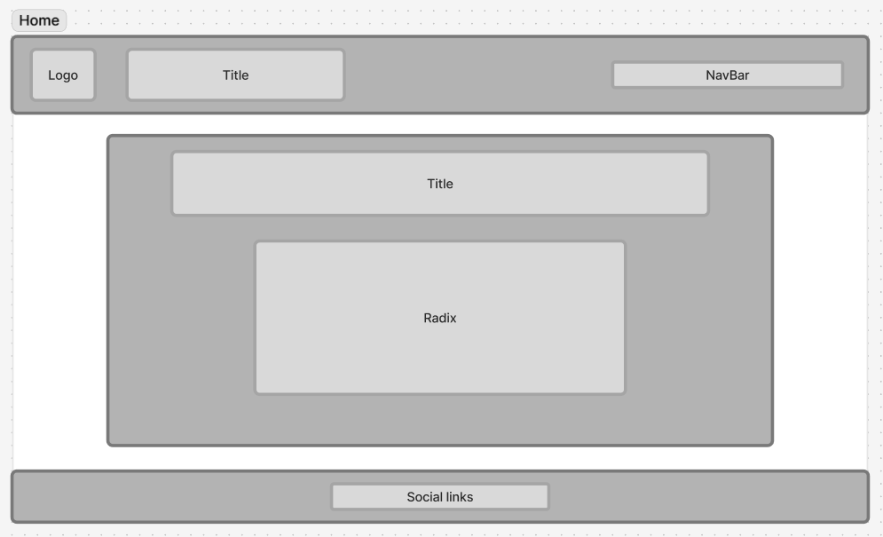
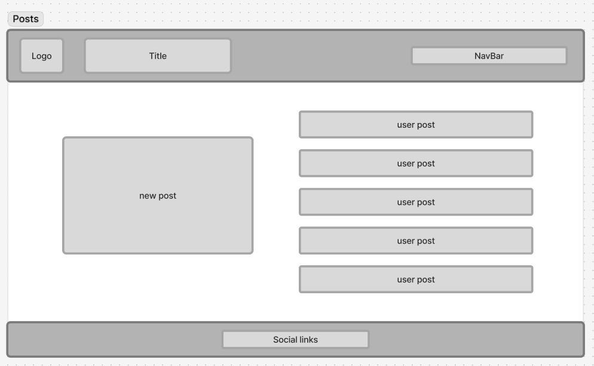
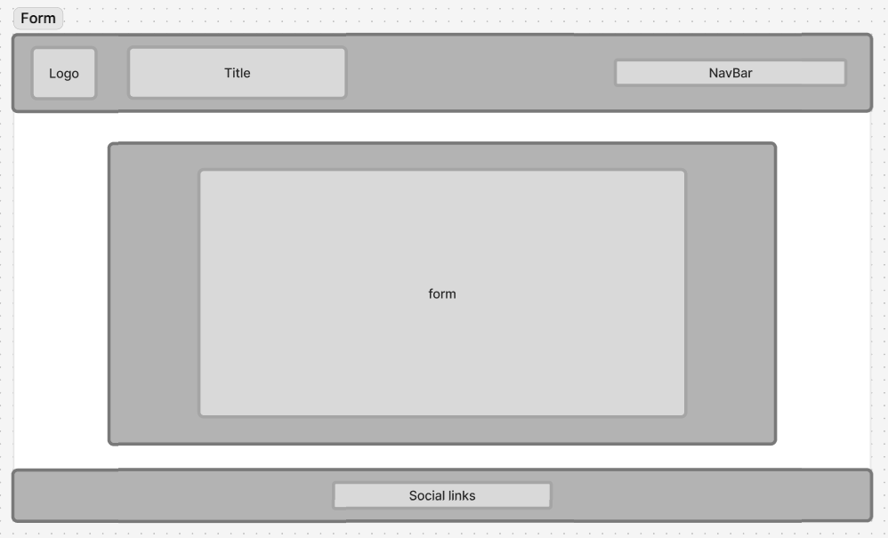
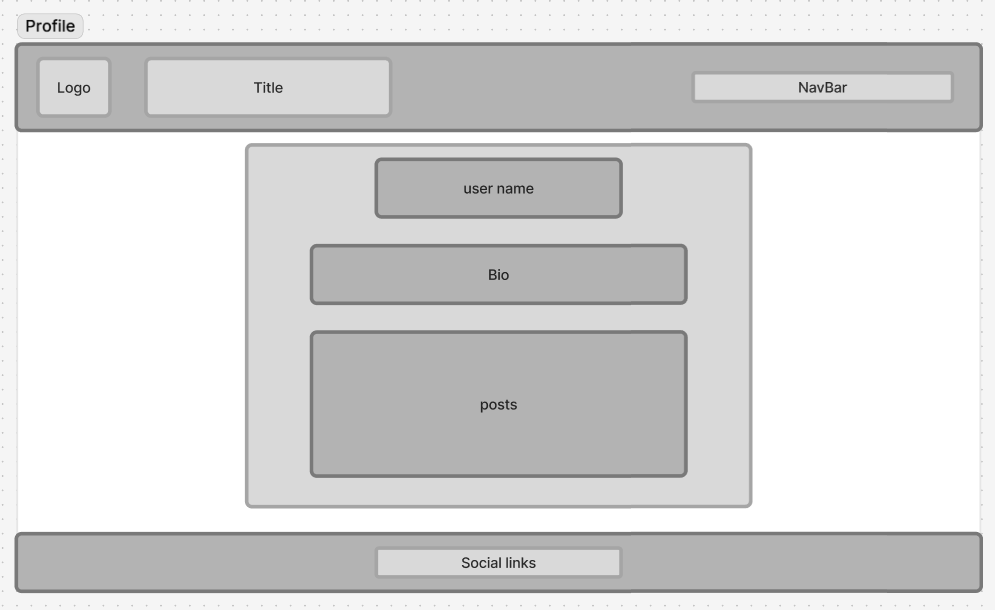

# Reflection

This week's assignment was to build a full-stack, database-driven social media application using Next.js. I've gained a lot of insight into how Next.js simplifies data handling and the creation of dynamic routes with the params object, having already developed apps that manage posting, display content, and comments. The primary focus was implementing authentication, which is crucial for creating user profiles and associating content with specific users—a skill that truly lays the foundation for a full-scale social application.

I won't lie, I found this assignment quite challenging and complex. There were many times where I hit a wall and got stuck on how to do things. When I first started this assignment, I tried doing it in TypeScript and kept getting small errors on things that would work fine in Next.js. I felt like trying to learn a whole new language on top of a complex app was way too much for me to handle for where I'm currently at. Another big wall I hit was trying to figure out how to get Clerk and Supabase to talk to each other so that the main ID/key for the table was the user's unique Clerk ID. Once I had figured it out, it seemed so simple.

For this assignment, I have had to put a lot of the ideas I had to one side, as I felt like I was just trying to do too much within the time limit we have. So, I've played it safe and tried to keep things as simple as they can be while also meeting the MVP goals. Once I get to a comfortable point where I'm happy with what I've got and feel like I have time to change or add things, then I might play around with different parts of the app.

I listened to your feedback and did a little bit of Tailwind within the header and footer. I do like the idea of it. I think I just need to spend a bit more time with it before I go full Tailwind. I think the only thing I don't like about it at the moment is how chaotic my code looks with the Tailwind, but I'd imagine the more I use it, the easier it will be to read.

If there is anything you think I could do better or improve on, I'd be happy to listen and learn from what you have to say.

# Requirements

- ✅ 🎯 Set up user sign-up and user login using Clerk.
- ✅ 🎯 Create and display an error/not found page if the user visits a page that doesn’t exist.
- ✅ 🎯 Use 1 or more Radix UI Primitive component, or something similar (e.g. use of a different component library to enhance UX, not just Tailwind).
- ✅ 🎯 Enable users to create a user profile, and input profile information (such as a user biography) using a form. Users and user information should be stored in their own table in the database and handled with an appropriate route.
- ✅ 🎯 Enable users to create posts associated with their Clerk userId. Posts should be displayed on the user’s profile page.

# Stretch Requirements

- ❓ 🏹 Ensure that a user’s biography cannot be left blank. If a user logs in without one, prompt them to add this information.

  - The way I have set my site up, I've kind of got this: if the user doesn't fill out the bio form, they won't have a profile and they can't leave comments. The bio is required to be filled in. So, can I get like half a point for that?

- ✅ 🏹 Allow users to update their content. You can achieve this either with a dynamic route `(“/posts/[id]/edit”)` or by creating a modal.
- ✅ 🏹 Allow users to delete their content.

# requirements that I wasn't able to achieve

- 🏹 Allow users to view other profiles directly from posts they see on the global timeline, using a dynamic users route `(e.g. /user/[userId])`.
- 🏹 Let users follow each other by establishing a follower and followee relationship between profiles.
- 🏹 Enable users to like posts by linking their user_id to the liked_post in a junction table.

# Wireframe

# Errors or Bugs I Encountered

- Just using TypeScript and getting errors over so many things, so I went back to just using Next.js.

# What went really well and what could have gone better?

- I feel my initial database setup could have been gone better. My mind just kept hitting a wall when I was trying to figure out how to make Clerk and Supabase talk to each other.
- Working with Radix could have gone a lot better. Their set-up guides are terrible; I feel like they could make them a lot better.
- I had to restart my repo on this assignment. I was lying in bed and couldn't sleep, so I figured I'd make a few quick changes to my READme. The next day, I forgot to pull them before I tried to push new work from my PC. Instead of dealing with the merge conflict, I just deleted the repo and restarted it from scratch.
- I wish I had more time! I forgot I had people coming around today (Sunday 12th), so the time I thought I had left to finish off the styling and other bits has now been cut massively.

# External sources

### Info

[My own repo](https://github.com/IndieMasco/TechEdSoftwareDeveloper021) , [Tech Ed repo](https://github.com/Tech-Educators/software-dev-021) , [FigJam](https://www.figma.com/board/JjN2Zgtoynrau06MjWJs6q/SD021?node-id=0-1&p=f&t=V1WCGcrmVKnoxJDr-0) , [MDN](https://developer.mozilla.org/en-US/) , [W3School](https://www.w3schools.com/) , [Next.js docs](https://nextjs.org/docs) , [Template](https://github.com/Tech-Educators/software-dev-021/tree/main/demos/week9/week9-assignment)

### Clerk

[Build your own sign-in-or-up page](https://clerk.com/docs/nextjs/guides/development/custom-sign-in-or-up-page) , [ClerkMiddleware()](https://clerk.com/docs/reference/nextjs/clerk-middleware) , [Catch-all Segments](https://nextjs.org/docs/app/api-reference/file-conventions/dynamic-routes#catch-all-segments) , [Appearance prop](https://clerk.com/docs/guides/customizing-clerk/appearance-prop/overview) , [Test emails and phone numbers](https://clerk.com/docs/guides/development/testing/test-emails-and-phones#email-addresses) , [auth()](https://clerk.com/docs/reference/nextjs/app-router/auth)

### Merging Supabase & Clerk

[Integrate Supabase with Clerk](https://clerk.com/docs/guides/development/integrations/databases/supabase)

### TailWind

[Get started with Tailwind CSS](https://tailwindcss.com/docs/installation/using-vite) , [Tailwind CSS for Beginners: Build Websites FASTER](https://www.youtube.com/watch?v=dcRenJApot0&t=4s)

### SQL

[sql-altertable](https://www.postgresql.org/docs/current/sql-altertable.html)
